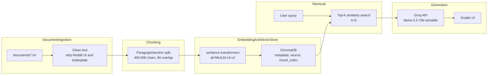

# Project 1 Planning: The Unofficial Guide

> Write this document before you write any pipeline code.
> Your spec and architecture diagram are what you'll use to direct AI tools (Claude, Copilot, etc.) to generate your implementation — the more specific they are, the more useful the generated code will be.
> Update the Retrieval Approach and Chunking Strategy sections if you change your approach during implementation.
> Update this file before starting any stretch features.

---

## Domain

Berkeley study spots — where to work on campus and nearby, and what each place is actually like (noise, outlets, WiFi, hours, crowding). Official channels (library homepages, campus maps) list locations and hours but not the practical details students care about: which room in Doe stays quiet, which café has outlets after 9pm, or which hidden spots empty out during finals. That knowledge lives in Reddit threads, student blogs, and one-off guides — scattered, inconsistent, and hard to search in one place.

**Example questions this system should handle:**

- What are the top-ranked library study spots at Berkeley, and why do students prefer them?
- Which libraries stay open past midnight during the semester?
- What Northside or Elmwood cafés do students recommend for studying, and what's the vibe?
- What hidden or lesser-known study spots exist on campus (e.g., Ishi Court, Women's Faculty Club Garden)?
- Where can I study late at night when main libraries are crowded?
- What do r/berkeley users recommend when someone asks for study spots?

---

## Documents

| # | Source | Description | URL or location |
|---|--------|-------------|-----------------|
| 1 | r/berkeley | Crowdsourced study spot recommendations and replies | https://www.reddit.com/r/berkeley/comments/cnr8wb/study_spots_in_berkeley/ → `documents/01_reddit_study_spots.txt` |
| 2 | life.berkeley.edu | Ranked top 5 libraries (hours, crowding, seat comfort) | https://life.berkeley.edu/top-5-library-study-spots/ → `documents/02_life_top_5_libraries.txt` |
| 3 | life.berkeley.edu | Library crawl walkthrough of specific rooms (Business, Doe NRR, Moffitt) | https://life.berkeley.edu/library-crawl/ → `documents/03_life_library_crawl.txt` |
| 4 | visit.berkeley.edu | Niche spots that empty out at night (Music Library, CAP Library, Stanley Hall, MLK Union) | https://visit.berkeley.edu/news/study-spot-suggestions-campus → `documents/04_visit_night_study_spots.txt` |
| 5 | visit.berkeley.edu | Lesser-trafficked underground spots (e.g., Ishi Court in Dwinelle) | https://visit.berkeley.edu/news/best-underground-spots-campus → `documents/05_visit_underground_spots.txt` |
| 6 | life.berkeley.edu | Hidden gems including Women's Faculty Club Garden | https://life.berkeley.edu/hidden-study-spots → `documents/06_life_hidden_spots.txt` |
| 7 | life.berkeley.edu | Northside cafés (Delah, Foothill Dining, V&A) with vibe and seating notes | https://life.berkeley.edu/northside-study-spots → `documents/07_life_northside_cafes.txt` |
| 8 | life.berkeley.edu | Elmwood/College Ave cafés (Baker & Commons, Souvenir, Timeless, Peet's/Philz) | https://life.berkeley.edu/best-elmwood-study-spots/ → `documents/08_life_elmwood_cafes.txt` |
| 9 | life.berkeley.edu | On-campus café directory with hours and food options | https://life.berkeley.edu/cal-campus-cafe-list → `documents/09_life_campus_cafe_list.txt` |
| 10 | visit.berkeley.edu | Student café ranking filtered for outlets, WiFi, bus access | https://visit.berkeley.edu/node/603 → `documents/10_visit_cafe_ranking.txt` |
| 11 | visit.berkeley.edu | Favorite coffee shops (Strada, Yali's, Brewed Awakening, Cafe Milano) | https://visit.berkeley.edu/news/best-coffee-shops-berkeley → `documents/11_visit_best_coffee_shops.txt` |
| 12 | visit.berkeley.edu | Campus coffee spots including closed "coffee ghosts" | https://visit.berkeley.edu/news/cals-coveted-caffeine-contributors → `documents/12_visit_coffee_cartographer.txt` |
| 13 | life.berkeley.edu | Library hours by closing time, late cafés, BearWalks safety info | https://life.berkeley.edu/late-night-in-berkeley → `documents/13_life_late_night.txt` |
| 14 | Berkeley Law | Peaceful study spots guide (scene, distance, directions) | https://www.law.berkeley.edu/files/Mindfulness_Initiative_Guide_to_Peaceful_Campus_Spots(1).pdf → `documents/14_law_mindfulness_guide.txt` |
| 15 | Simons Institute | Café/restaurant list by distance from campus with seating notes | https://simons.berkeley.edu/berkeley-restaurant-recommendations → `documents/15_simons_restaurants.txt` |

---

## Chunking Strategy

My corpus mixes four document shapes: location-based sections (library rankings, hidden spots), short café blurbs, directory-style lists, and a noisy Reddit thread. A single fixed character split would break location sections mid-thought or merge unrelated spots. I will use **structure-aware chunking** — split on document structure first, then apply a character size cap.

**Chunk size:** ~400–600 characters (~80–120 tokens), with a hard max of ~700 characters before forcing a split within a section.

**Overlap:** ~80–100 characters (~15–20% of chunk size).

**Reasoning:**

Most of my files are organized by place, not by sentence. Each library in `02_life_top_5_libraries.txt` is several paragraphs with hours on one line and description on the next. A ~500-character chunk usually keeps a spot's name, hours, and key details together — small enough for precise retrieval, large enough to stand alone.

**Split rules (structure first, size second):**
- Double newlines → paragraph boundaries
- `---` separators in `14_law_mindfulness_guide.txt` → one spot per chunk
- Numbered headings (`1. Ishi Court`) in `05_visit_underground_spots.txt` → new chunk at each spot
- Reddit (`01_reddit_study_spots.txt`): after cleaning UI junk, one chunk per substantive reply

**Why overlap:** Hours often appear on the line before the descriptive paragraph (e.g., VLSB in doc 02). Overlap prevents a query like "What are VLSB library hours?" from retrieving only the description chunk without times.

**Preprocessing before chunking:**
- Strip Reddit UI tokens (`Upvote`, `Downvote`, `Reply`, `Share`, `Award`, avatar/username lines)
- Remove image-caption boilerplate (`A collage of…`, `decorative image`)
- Collapse excessive blank lines
- Parse `Source:` header into metadata; exclude it from chunk body text

**How I'll detect bad chunks:**
- Too small: fragments like `"Open until 2 a.m.: Main Stacks"` with no context; high retrieval distance scores
- Too large: one chunk mixing unrelated spots (Ishi Court + Women's Faculty Club); generic retrieval matches

**Target chunk count:** ~80–150 chunks across 15 documents. Below 50 suggests chunks are too large; above 300 suggests they are too small.

---

## Retrieval Approach

**Embedding model:** `all-MiniLM-L6-v2` via `sentence-transformers` (local, no API key, matches project default).

**Top-k:** 5 chunks per query.

Study-spot questions often need hours, location, and vibe from different sentences in the same or adjacent chunks. k=5 gives the LLM enough context without pulling in unrelated sections from multi-topic pages like `13_life_late_night.txt` (which mixes study, food, and safety). k=2 risks missing the one document that mentions a hidden spot; k=10 dilutes context with loosely related café directories from `15_simons_restaurants.txt`.

Semantic search fits this domain because users ask in plain language ("quiet place besides big libraries") without exact keywords — embeddings match intent, so a query can retrieve "Bio library or southeast asian library" from the Reddit thread without those exact words in the question.

**Production tradeoff reflection:**

If cost were not a constraint, I would weigh stronger domain models (`bge-small-en-v1.5`, `e5-base-v2`) for better matching on short opinion text and campus nicknames like "Main Stacks" or "Soda." Longer-context embedding models would help if I kept whole library sections unsplit. Multilingual embeddings would matter if I added non-English student reviews. MiniLM's advantage is zero API cost and low latency running locally; hosted models add billing and network latency but scale better for many concurrent users. Embeddings alone cannot fix stale facts — Moffitt's renovation closure appears inconsistently across sources, which is a corpus freshness problem, not an embedding problem.

---

## Evaluation Plan

| # | Question | Expected answer |
|---|----------|-----------------|
| 1 | Which library is ranked #1 for study spots and why? | **Moffitt** — ranked first for the longest open hours among UC Berkeley libraries, variety of spaces (desks, study rooms, patio, pods), many outlets, and accessibility for collaboration. Source notes Moffitt is closed for renovations starting January 2025. (`02_life_top_5_libraries.txt`) |
| 2 | Which libraries stay open until 2 a.m.? | **Main Stacks** stays open until 2 a.m. The same source also lists Moffitt as 24 hours but notes Moffitt closed for renovations starting January 2025. (`13_life_late_night.txt`) |
| 3 | Where is Ishi Court and how do students recommend finding it? | Ishi Court is a hidden **courtyard inside Dwinelle Hall**. Students recommend entering Dwinelle through the **North entrance** and going straight in; using the main entrance can lead to circling hallways and staircases. (`05_visit_underground_spots.txt`, `06_life_hidden_spots.txt`) |
| 4 | What do students say about Delah Coffee as a Northside study spot? | Delah is on **Euclid Avenue** with quiet background music, **outlets and barstool seating**, Arabian coffee for less than $5, and a "bougie" studious vibe (tiled ceiling, velvet chairs). (`07_life_northside_cafes.txt`) |
| 5 | What non-library spots do r/berkeley users recommend for studying? | Thread recommends **Brewed Awakening** on Euclid, **Cafe Milano upstairs** (less theft risk), **empty Dwinelle classrooms** in summer, **MLK**, **Boalt law cafe**, and **Soda computer labs** (CS keycard access). Answer should reflect the thread's non-library focus, not only libraries. (`01_reddit_study_spots.txt`) |

---

## Anticipated Challenges

1. **Reddit/UI noise in retrieval** — `01_reddit_study_spots.txt` contains Upvote/Downvote lines, usernames, and joke replies ("recommends libraries anyway"). If cleaning is incomplete, embeddings may match generic social UI text instead of actual study recommendations.

2. **Stale or conflicting hours** — Moffitt is praised for long/24-hour access in several docs, but multiple sources note **renovation closure from January 2025**. Retrieval may return a chunk with hours but not the closure note (or vice versa), producing a partially accurate answer.

3. **Multi-topic documents diluting retrieval** — `13_life_late_night.txt` mixes late-night study hours, restaurants, and safety shuttles (BearWalk, Bear Transit). A query about library hours may retrieve Safewalk or dining paragraphs with misleading similarity scores.

4. **Duplicate spots across sources** — Ishi Court, Moffitt, and Delah appear in many files. Retrieval may return redundant chunks, and the LLM may over-weight the most verbose description rather than the most relevant detail for the question.

---

## Architecture

**Pipeline stages:**
1. **Document Ingestion** — load `documents/*.txt`, clean text (Python stdlib + regex)
2. **Chunking** — structure-aware split with size cap and overlap (custom `chunk_text()`)
3. **Embedding + Vector Store** — `all-MiniLM-L6-v2` → ChromaDB with source metadata
4. **Retrieval** — ChromaDB similarity search, top-k=5
5. **Generation** — Groq `llama-3.3-70b-versatile` with grounded prompt; Gradio query interface

---

## AI Tool Plan

**Milestone 3 — Ingestion and chunking:**

- **Tool:** Claude
- **Input:** Documents table, Chunking Strategy section, Architecture diagram, and sample excerpts from `02_life_top_5_libraries.txt` (structured library section) and `01_reddit_study_spots.txt` (noisy Reddit UI)
- **Expected output:** `load_documents()` to read all files from `documents/`, `clean_text()` with Reddit/boilerplate stripping, and `chunk_text()` implementing structure-first splitting with 400–600 char target and 80–100 char overlap
- **Verification:** Print one fully cleaned document and confirm no Upvote/HTML artifacts remain; print 5 sample chunks and confirm Ishi Court is self-contained; record total chunk count (target 80–150)

**Milestone 4 — Embedding and retrieval:**

- **Tool:** Claude
- **Input:** Retrieval Approach section, Architecture diagram, and chunk output format from Milestone 3
- **Expected output:** Script to embed chunks with `SentenceTransformer("all-MiniLM-L6-v2")`, persist to ChromaDB with `source` and `chunk_index` metadata, and a `retrieve(query, k=5)` function returning chunk text, source filename, and distance score
- **Verification:** Run 3 evaluation questions from this plan; confirm top results are on-topic with distance below ~0.5; write a one-sentence relevance explanation for at least 2 queries

**Milestone 5 — Generation and interface:**

- **Tool:** Claude
- **Input:** Project grounding requirements (context-only answers, source attribution, refusal when insufficient), retrieved chunk format, and Gradio skeleton from assignment instructions
- **Expected output:** `ask(question)` returning `{answer, sources}`, a system prompt that enforces grounding and declines out-of-scope questions, and `app.py` Gradio UI wiring query → answer + sources
- **Verification:** Test 2–3 eval questions end-to-end with visible source citations; ask an out-of-scope question (e.g., "Best study spot at Stanford?") and confirm the system refuses rather than hallucinating; confirm answers trace to retrieved chunk text, not generic advice
